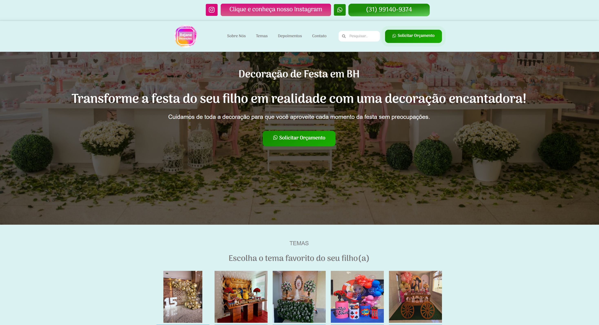
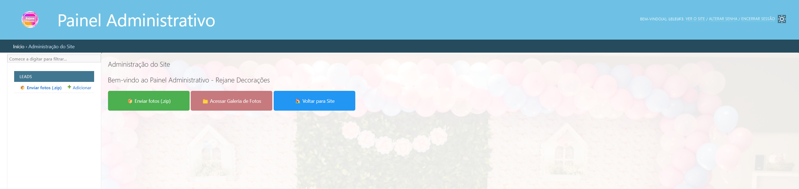
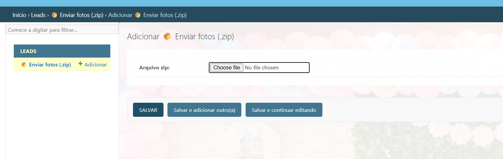
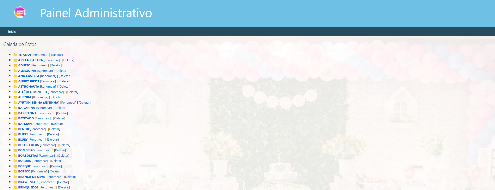
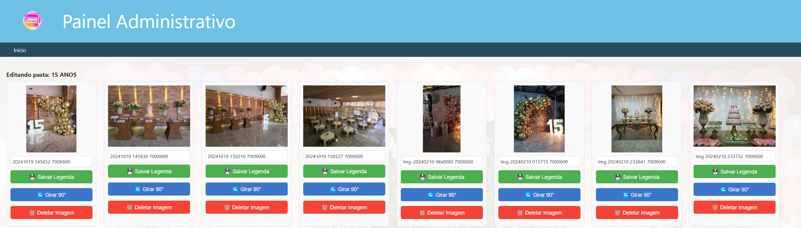

### PROJETO: Rejane Decorções - BH

Esse projeto foi desenvolvido para dar continuidade a um sistema desenvolvido em Wordpress.
O intuito foi criar funcionalidadaes para facilitar o manejo e gestão das fotos do portifólio
da Rejane.

### FUNCIONALIDADES

As funcionalidades incluídas foram:
 - Fazer upload de pasta .zip
 - Alterar a legenda das imagens
 - Rotacionar imagens que estão com a orientação errada

### COMO FUNCIONA

Após o administrador do sistema fazer o upload do arquivo .zip, o mesmo
é utilizado para criar uma seção nova na página inicial de portifólios pegando
o nome da pasta como título.
As imagens são redimensionadas para não sobrecarregar o sistema e as rotas
são criadas automáticamete.

### IMAGENS DAS FUNCIONALIDADES

##### HOME

#### ADMIN

#### UPLOAD

#### GALERIA

#### GESTÃO DAS IMAGENS

